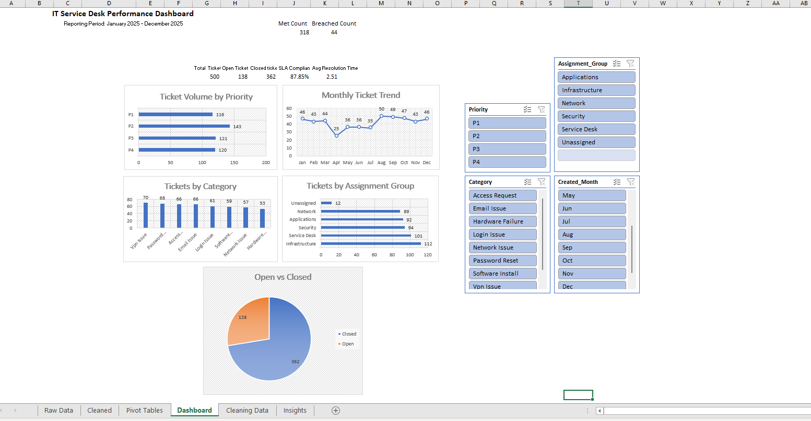

# IT Service Desk Performance Dashboard 

## Project Overview
An interactive Excel dashboard built using a simulated IT Service Desk dataset. This project demonstrates data cleaning, Pivot Tables, Pivot Charts, KPI reporting, and interactive slicers to analyze ticket performance and SLA compliance.

## Skills

- Data Cleaning
- Pivot Tables
- Pivot Charts
- Excel Formulas
- Dashboard Development
- KPI Reporting

## Dashboard Preview

## Key Insights

- VPN Issue was the most common support request.
- Most resolved tickets met the target SLA (~86%).
- Resolution time generally decreased as ticket priority increased.

